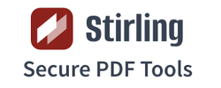

# mrwogu Home Assistant add-ons

Home Assistant add-ons packaged from upstream projects with automated updates, multi-architecture images, and security-focused defaults.

## Add-ons

<table>
  <tr>
    <td align="center" valign="top" width="33%">
      
      <h3><a href="gluetun/">Gluetun VPN</a></h3>
      
VPN client supporting multiple providers, OpenVPN, WireGuard, DNS filtering, and proxy services.

      
<code>amd64</code> <code>aarch64</code> <a href="https://github.com/passteque/gluetun">Upstream</a> · MIT

    </td>
    <td align="center" valign="top" width="33%">
      
      <h3><a href="bonds/">Bonds</a></h3>
      
Personal relationship manager built with Go and React.

      
<code>amd64</code> <code>aarch64</code> <a href="https://github.com/naiba/bonds">Upstream</a> · Business Source License 1.1

      
SQLite by default. PostgreSQL is optional and external.

      
Commercial use and managed hosting restrictions apply.

    </td>
    <td align="center" valign="top" width="33%">
      
      <h3><a href="stirling-pdf/">Stirling-PDF</a></h3>
      
Locally hosted web application for splitting, merging, converting, OCR, and otherwise manipulating PDF files.

      
<code>amd64</code> <code>aarch64</code> · Port <code>8080</code> <a href="https://github.com/Stirling-Tools/Stirling-PDF">Upstream</a> · MIT

    </td>
  </tr>
  <tr>
    <td align="center" valign="top" width="33%">
      
      <h3><a href="authentik/">authentik</a></h3>
      
Self-hosted identity provider for single sign-on, SAML, OAuth2, and LDAP.

      
<code>amd64</code> <code>aarch64</code> · Port <code>9000</code> <a href="https://github.com/goauthentik/authentik">Upstream</a> · MIT

      
Requires external PostgreSQL.

    </td>
    <td align="center" valign="top" width="33%">
      
      <h3><a href="n8n/">n8n</a></h3>
      
Workflow automation platform for connecting apps and services.

      
<code>amd64</code> <code>aarch64</code> · Port <code>5678</code> <a href="https://github.com/n8n-io/n8n">Upstream</a> · Sustainable Use License

      
SQLite by default. PostgreSQL and Redis are optional.

    </td>
    <td align="center" valign="top" width="33%">
      
      <h3><a href="traefik-proxy/">Traefik Proxy</a></h3>
      
File-configured reverse proxy with TLS, real-IP logging, and Cloudflare-aware operations.

      
<code>amd64</code> <code>aarch64</code> · Ports <code>80</code> and <code>443</code> <a href="https://github.com/traefik/traefik">Upstream</a> · MIT

      
Docker provider disabled. Dashboard is not published.

    </td>
  </tr>
  <tr>
    <td align="center" valign="top" width="33%">
      
      <h3><a href="tududi/">Tududi</a></h3>
      
Self-hosted task management and life organization system for tasks, projects, notes, and areas.

      
<code>amd64</code> <code>aarch64</code> · Port <code>3002</code> <a href="https://github.com/chrisvel/tududi">Upstream</a> · MIT

    </td>
    <td align="center" valign="top" width="33%">
      
      <h3><a href="mem0/">Mem0</a></h3>
      
Self-hosted AI memory layer with a REST API for assistants and agents.

      
<code>amd64</code> <code>aarch64</code> · Port <code>8000</code> <a href="https://github.com/mem0ai/mem0">Upstream</a> · Apache 2.0

      
REST API only. Requires external PostgreSQL with pgvector.

    </td>
  </tr>
</table>

## Installation

1. Open Home Assistant.
2. Go to **Settings > Apps > App store**.
3. Open the repository menu.
4. Add `https://github.com/mrwogu/hassio-addons`.
5. Install the selected add-on.

## Updates

Renovate checks upstream releases and image digests every six hours. Updates
become eligible after three days, receive a pull request, pass adapter tests
and changed add-on builds on `amd64` and `aarch64`, and merge without review.
Successful merges publish immutable GHCR images and per-add-on GitHub Releases.

## Support

Report packaging, startup, or Home Assistant integration problems in this repository. Report application bugs directly to the respective upstream project.

These packages are community-maintained and are not endorsed by Home Assistant or the upstream projects.

Report packaging, workflow, supply-chain, or secret-handling vulnerabilities
through [private vulnerability reporting](https://github.com/mrwogu/hassio-addons/security/advisories/new).
Report application vulnerabilities to the relevant upstream project.

## License

Repository integration code uses the MIT License. Packaged applications retain their upstream licenses, included in each add-on directory.
